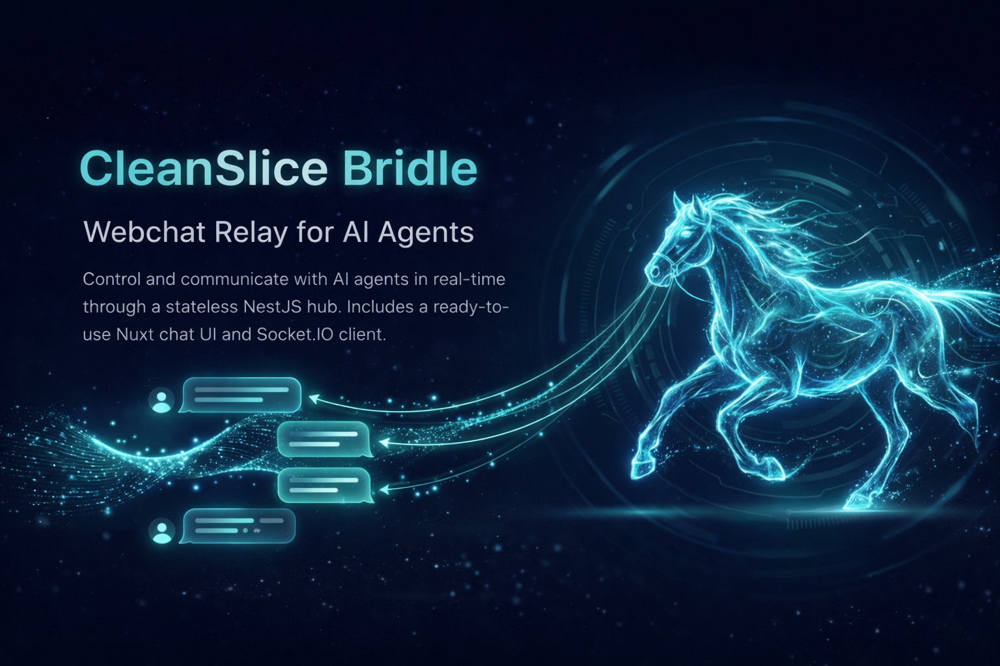

# Bridle

Webchat relay for AI agents. Bridle connects browser users to an agent runtime through a stateless NestJS hub, with a ready-made Nuxt chat UI and an agent-side Socket.IO client.

[Protocol Specification](./docs/PROTOCOL.md) | [Hub Server (NestJS)](./nestjs/README.md) | [Chat UI (Nuxt)](./nuxt/README.md) | [Agent Client (Runtime)](./runtime/README.md)

```
Browser (Nuxt)               Bridle Hub (NestJS)           Agent Runtime
     |                             |                             |
     |--- /ws/chat --------------->|                             |
     |   auth: { token, botId }    |--- /ws/agent -------------->|
     |                             |   auth: { apiKey, botId }   |
     |<--- stream/message ---------|<--- stream/message ---------|
     |   { text, parts[] }         |   { text, parts[] }         |
```

The hub is **stateless** -- it holds no message history. It routes messages between browsers and agents in real time using Socket.IO. Multiple bots can connect simultaneously, each scoped by `botId`. All messages carry rich `parts[]` (text, images, files) alongside a plain `text` shorthand.

## Quick Install

Copy this prompt into Claude Code to add Bridle to your CleanSlice project:

~~~
Add the Bridle webchat to this project. The repo is at https://github.com/CleanSlice/bridle

Steps:

1. Clone the bridle repo next to this project (or reference it if already cloned).

2. **NestJS API** — integrate the hub server:
   - Copy `bridle/nestjs/` into `api/src/slices/bridle/`
   - Import `BridleModule` in `app.module.ts`
   - Install deps: `npm i @nestjs/websockets @nestjs/platform-socket.io socket.io @nestjs/jwt`
   - Add to `.env`: `BRIDLE_API_KEY=<generate-a-secret>` and `JWT_SECRET=<your-jwt-secret>`
   - The `#core` alias must resolve (for FlatResponse decorator). If it doesn't exist, remove the `FlatResponse` import and decorator from `bridle.controller.ts`

3. **Nuxt App** — integrate the chat UI:
   - Copy `bridle/nuxt/` into `app/slices/bridle/`
   - Add the slice as a Nuxt layer in `app/nuxt.config.ts`: `extends: ['./slices/bridle']`
   - Install deps: `npm i socket.io-client`
   - Use the component: `<BridleProvider api-url="http://localhost:3333" bot-id="my-bot" :token="authToken" />`
   - The component imports from `#theme` (shadcn-vue Card, ScrollArea, etc). Make sure the theme slice exists or adapt imports.

4. **Agent Runtime** — integrate the client:
   - Copy `bridle/runtime/bridle.repository.ts` into the runtime's channel repositories
   - Import and register `BridleRepository` as a channel with apiUrl from env
   - Add to the bot's `.env`: `BRIDLE_URL=http://localhost:3333`, `BRIDLE_BOT_ID=<bot-id>`, `BRIDLE_API_KEY=<same-as-BRIDLE_API_KEY>`

5. **Verify**:
   - Start the API, confirm `/api/agent/health` returns `{ ok: true, agentConnected: false, browserClients: 0 }`
   - Start the agent runtime, confirm it connects and `/api/agent/<botId>/health` shows `agentConnected: true`
   - Open the Nuxt app with the BridleProvider component, confirm the chat connects and messages flow

Read the bridle README.md and docs/PROTOCOL.md for full auth details, parts format, and type definitions.
~~~

## Packages

| Directory | Description | Stack |
|-----------|-------------|-------|
| `nestjs/` | Hub server -- WebSocket relay + HTTP fallback | NestJS, Socket.IO, JWT |
| `nuxt/` | Chat UI -- drop-in component + Pinia store | Nuxt 3, Vue 3, shadcn-vue |
| `runtime/` | Agent client -- connects to the hub as a channel | Socket.IO client |

## Message Parts

All messages carry a `parts: BridlePart[]` array for rich content. The `text` field is always present as a plain-text shorthand.

```typescript
// Part types on the wire
{ type: "text",  text: "Hello" }
{ type: "image", base64: "...", mediaType: "image/jpeg" }
{ type: "file",  url: "https://...", name: "doc.pdf", mimeType: "application/pdf" }
```

Parts flow end-to-end:

- **Browser → Hub**: sends `{ text, parts }` (or legacy `{ text, images }` which the hub converts)
- **Hub → Agent**: forwards `{ text, parts, clientId, messageId }`
- **Agent → Hub → Browser**: responds with `{ text, parts, messageId, ts }`
- **Streaming**: `stream` and `stream_end` events also carry `parts`

The Nuxt chat UI renders each part type: text as paragraphs, images inline, files as download links.

## Authentication

Bridle authenticates both sides of the connection in the Socket.IO handshake. Auth is checked in `handleConnection` -- unauthorized clients are disconnected immediately before any events are processed.

### Agent auth (apiKey + botId)

Agent runtimes prove identity with a shared API key and declare which bot they serve:

```typescript
io('http://hub-host/ws/agent', {
  auth: {
    apiKey: process.env.BRIDLE_API_KEY,  // Shared secret
    botId: process.env.BRIDLE_BOT_ID,    // Which bot this agent serves
  },
})
```

The hub validates `apiKey` against the `BRIDLE_API_KEY` environment variable. If the key is missing or wrong, the connection is rejected. `botId` is required -- it scopes all message routing to that bot.

### Browser auth (JWT + botId)

Browser clients authenticate with a JWT token and specify which bot to chat with:

```typescript
io('http://hub-host/ws/chat', {
  auth: {
    token: 'eyJhbG...',                   // JWT from your auth system
    botId: 'bot-abc-123',                  // Which bot to chat with
  },
})
```

The hub verifies the JWT using NestJS `JwtService`. The token payload determines identity:

| JWT field | Usage |
|-----------|-------|
| `sub` | Used as `clientId` for message routing |
| `email` | Stored in socket data for logging |
| `roles` | If includes `'ADMIN'`, `clientId` is set to `'admin'` |

### Admin detection

When the JWT payload contains `roles: ['ADMIN']`, the hub sets `clientId = 'admin'` instead of `sub`. This allows the agent runtime's access control to recognize admin users:

```typescript
// In the agent runtime
if (msg.from === 'admin') {
  // This user has admin privileges
}
```

### Per-bot isolation

Each bot agent registers with its own `botId`. Browser clients also declare a `botId` when connecting. The hub enforces isolation:

- Messages from a browser are only forwarded to the agent matching that `botId`
- Agent responses are only routed to browsers registered under the same `botId`
- Multiple bots can serve different users simultaneously through the same hub

```
Bot A (/ws/agent, botId: "bot-a")     Hub      Browser 1 (/ws/chat, botId: "bot-a")
Bot B (/ws/agent, botId: "bot-b")     Hub      Browser 2 (/ws/chat, botId: "bot-b")
```

### Why handleConnection, not NestJS guards?

NestJS WebSocket guards (`@UseGuards`) only run on `@SubscribeMessage` handlers, not on the initial connection. An unauthorized client would stay connected and receive broadcast events. Checking credentials in `handleConnection` + calling `client.disconnect(true)` is simpler and more secure.

## Hub Server (NestJS)

The hub exposes two WebSocket namespaces and an HTTP API:

| Endpoint | Auth | Purpose |
|----------|------|---------|
| `/ws/chat` | JWT + botId | Browser clients connect here |
| `/ws/agent` | apiKey + botId | Agent runtimes connect here |
| `POST /api/agent/:botId/message` | Bearer token | HTTP fire-and-forget message |
| `POST /api/agent/:botId/message/sync` | Bearer token | HTTP synchronous message (120s timeout) |
| `GET /api/agent/health` | -- | Overall hub status |
| `GET /api/agent/:botId/health` | -- | Per-bot status |

### Usage

```typescript
// app.module.ts
import { BridleModule } from 'bridle/nestjs'

@Module({
  imports: [BridleModule],
})
export class AppModule {}
```

`BridleModule` imports `ConfigModule` (for `BRIDLE_API_KEY`) and `JwtModule` (for token verification). Your app must have `JWT_SECRET` configured.

### Exports

```typescript
// Module
BridleModule

// Domain (abstract gateway + types)
IBridleGateway          // Abstract class -- DI token
IBridleHealthData       // { ok, agentConnected, browserClients }
IBridleBotHealthData    // { ok, agentConnected, browserClients, botId }
IBridleIncomingMessage  // Hub -> Agent message (includes botId + parts)
IBridleOutgoingEvent    // Agent -> Hub event (includes parts)
IBridleClientData       // { botId, send } -- registered client metadata
BridlePartTypes         // Enum: Text, Image, File
BridlePart              // Union type for wire parts
buildParts              // Helper: text + images -> BridlePart[]
getTextFromParts        // Helper: BridlePart[] -> string

// Data (concrete implementation)
BridleGateway           // Hub implementation with per-bot maps

// Presentation
BridleController        // HTTP endpoints (/:botId scoped)
BridleAgentWsHandler    // Agent WebSocket handler (apiKey auth)
BridleChatWsHandler     // Browser WebSocket handler (JWT auth)

// DTOs
SendMessageDto          // Request body (text + parts + legacy images)
BridleHealthDto         // Response for /api/agent/health
BridleBotHealthDto      // Response for /api/agent/:botId/health (includes botId)
```

## Chat UI (Nuxt)

A drop-in chat widget built with shadcn-vue. Connects to the hub via Socket.IO with JWT authentication and manages all state through a Pinia store. Renders rich message parts (text, images, files).

### Usage

Add the slice as a Nuxt layer, then use the component:

```vue
<template>
  <BridleProvider
    api-url="http://localhost:3333"
    bot-id="bot-abc-123"
    :token="authToken"
  />
</template>
```

### Components

| Component | File | Description |
|-----------|------|-------------|
| `BridleProvider` | `components/bridle/Provider.vue` | Full chat widget -- connection, messages, input |
| `BridleMessage` | `components/bridle/Message.vue` | Message bubble with parts rendering (text, images, files) |
| `BridleInput` | `components/bridle/Input.vue` | Text input with send button |

### Props

| Prop | Type | Required | Description |
|------|------|----------|-------------|
| `apiUrl` | string | yes | Hub server URL |
| `botId` | string | yes | Which bot to chat with |
| `token` | string | yes | JWT token for authentication |
| `title` | string | no | Header title (default: "Agent Chat") |
| `placeholder` | string | no | Input placeholder text |
| `showStatus` | boolean | no | Show connection indicator (default: true) |

### Store

```typescript
const store = useBridleStore()

store.connect('http://localhost:3333', 'bot-abc-123', jwtToken)
store.sendMessage('Hello')
store.disconnect()

// Reactive state
store.messages     // IBridleMessageData[] (each has .text + .parts[])
store.isConnected  // boolean
store.isTyping     // boolean
store.isOpen       // boolean (for toggle UI)
store.clientId     // string | null (assigned by hub)
```

The store handles `connect_error` events -- if the JWT is invalid or expired, `isConnected` stays `false` and the error is logged to console.

### Nuxt Config

The slice registers a `#bridle` alias:

```typescript
// nuxt.config.ts
export default defineNuxtConfig({
  extends: ['./path/to/bridle/nuxt'],
})
```

## Agent Client (Runtime)

`BridleRepository` connects to the hub as a Socket.IO client and implements the `IChannelGateway` interface. It authenticates using `BRIDLE_API_KEY` and `BRIDLE_BOT_ID` environment variables. Sends and receives `parts[]` on the wire.

### Usage

```typescript
import { BridleRepository } from 'bridle/runtime/bridle.repository'

const bridle = new BridleRepository('http://localhost:3333')

bridle.onMessage(async (msg) => {
  console.log(`[${msg.from}]: ${msg.text}`)
  console.log(`parts:`, msg.parts)  // BridlePart[]

  // Simple text response
  await bridle.send(msg.from, 'Hello from the agent!')

  // Response with parts (text + image)
  await bridle.send(msg.from, 'Here is the result:', [
    { type: 'text', text: 'Here is the result:' },
    { type: 'image', base64: '...', mediaType: 'image/png' },
  ])

  // Stream a text response
  await bridle.streamSend(msg.from, async (onChunk) => {
    const text = await generateResponse(msg.text, onChunk)
    return text
  })
})

await bridle.start()
```

The repository reads auth credentials from environment variables on connect:

```typescript
auth: {
  apiKey: process.env.BRIDLE_API_KEY,
  botId: process.env.BRIDLE_BOT_ID,
}
```

### Streaming

`streamSend` accepts a streamer function. The agent calls `onChunk` with **accumulated text** as it generates. Bridle batches these into `stream` events every 100ms and sends a final `stream_end` when the streamer resolves. Stream events carry `parts: [{ type: "text", text }]` alongside the `text` field.

```typescript
await bridle.streamSend(clientId, async (onChunk) => {
  let accumulated = ''
  for await (const token of llmStream) {
    accumulated += token
    onChunk(accumulated)  // Accumulated, not delta
  }
  return accumulated
})
```

## Protocol

See [PROTOCOL.md](./docs/PROTOCOL.md) for the full specification including:

- Wire format for `parts[]` (text, image, file)
- WebSocket event schemas for both connections
- HTTP API request/response formats
- Streaming model (accumulated text, not deltas)
- Sequence diagrams for all message flows
- TypeScript type definitions
- Backward compatibility with legacy `images` field

## Environment Variables

| Variable | Where | Required | Description |
|----------|-------|----------|-------------|
| `BRIDLE_API_KEY` | Hub + Agent | yes | Shared secret for agent auth. Hub validates, agent sends. |
| `BRIDLE_BOT_ID` | Agent | yes | Bot identifier sent in handshake |
| `BRIDLE_URL` | Agent | yes | Hub URL, e.g. `http://localhost:3333` |
| `JWT_SECRET` | Hub | yes | Secret for JWT verification of browser tokens |

## Architecture

Bridle follows CleanSlice conventions:

```
bridle/
├── nestjs/                          # Hub server
│   ├── bridle.module.ts             # NestJS module (ConfigModule + JwtModule)
│   ├── bridle.controller.ts         # HTTP endpoints (/:botId scoped)
│   ├── handlers/
│   │   ├── bridleChatWs.handler.ts  # Browser WebSocket (JWT auth)
│   │   └── bridleAgentWs.handler.ts # Agent WebSocket (apiKey auth)
│   ├── domain/
│   │   ├── bridle.types.ts          # Part types, wire protocol interfaces
│   │   └── bridle.gateway.ts        # Abstract gateway (botId + parts aware)
│   ├── data/
│   │   └── bridle.gateway.ts        # Concrete implementation (per-bot maps)
│   └── dtos/
│       ├── sendMessage.dto.ts       # Request DTO (text + parts + legacy images)
│       └── bridleHealth.dto.ts      # Response DTO
├── nuxt/                            # Chat UI
│   ├── stores/bridle.ts             # Pinia store (parts-aware)
│   ├── components/bridle/
│   │   ├── Provider.vue             # Chat widget (apiUrl + botId + token)
│   │   ├── Message.vue              # Renders text, images, files from parts
│   │   └── Input.vue                # Text input
│   └── nuxt.config.ts
├── runtime/                         # Agent client
│   └── bridle.repository.ts         # Socket.IO client (sends/receives parts)
└── docs/
    └── PROTOCOL.md                  # Protocol specification
```

## Design Decisions

**Rich parts on the wire.** Every message carries `parts: BridlePart[]` — an array of typed content blocks (text, image, file). The `text` field is always present as a shorthand. Legacy clients sending `{ text, images }` are auto-converted via `buildParts()`. This allows agents to respond with mixed content (text + images + file links) in a single message.

**Stateless hub.** The hub holds no message history. Browser clients maintain their own message list. This keeps the hub simple and horizontally scalable.

**Per-bot isolation.** `agents: Map<botId, send>` and `clients: Map<clientId, { botId, send }>`. Multiple bots connect simultaneously, each scoped by `botId`. No Socket.IO rooms -- just maps with botId filtering.

**Auth in handleConnection.** NestJS WS guards only run on `@SubscribeMessage`, not on connect. Checking auth in `handleConnection` + `client.disconnect(true)` ensures unauthorized clients never receive events.

**Shared API key for agents.** All bot runtimes are deployed by the same system. `BRIDLE_API_KEY` provides authentication, `botId` provides identity. No need for per-bot tokens.

**JWT for browsers.** The admin panel already has a JWT flow. The token is passed in Socket.IO's `auth` field. Admin users (`roles: ['ADMIN']`) get `clientId = 'admin'` for runtime access control integration.

**Accumulated text streaming.** Each `stream` event contains the full text so far, not a delta. Simpler to implement (client just replaces text), trades bandwidth for correctness. Stream chunks are batched at 100ms intervals.

**Abstract gateway.** The hub logic is behind `IBridleGateway` (abstract class as DI token). The concrete `BridleGateway` can be swapped without changing the controller or WebSocket handlers.
